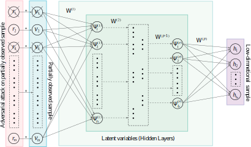

# EADNMF
## Elastic Adversarial Deep Nonnegative Matrix Factorization for Matrix Completion
Jut run 'EADNMF.ipynb'.

  *Seyed Amjad Seyedi, Fardin Akhlaghian Tab, Abdulrahman Lotfi, navid Salahian, Jovan Chavoshinejad*
  
  *Information Sciences 2023*

  
  *https://doi.org/10.1016/j.ins.2022.11.120*

  # Abstract

In recent years, matrix completion has attracted a lot of attention. Conventional matrix completions are shallow and ineffective when dealing with complex data structures. Researchers have recently tried to incorporate deep structures into matrix completion; however, considerable challenges still exist. Most matrix completion methods may fail to work effectively in the presence of limited observations. To enhance the generalization of the reconstruction, adversarial methods are proposed that attempt to fool models by providing deceptive input. The aim is to develop an adversarial training algorithm that resists attacks in a deep model, thus at the same time leading to enhancing the generalization. Therefore, in this paper, we propose an elastic adversarial training to design a high-capacity Deep Nonnegative Matrix Factorization (DNMF) model with proper discovery latent structure of the data and enhanced generalization abilities. In other words, the challenges mentioned above are addressed by perturbing the inputs in DNMF with an elastic loss which is intercalated and adapted between Frobenius and L2,1 norms. This model not only dispenses with adversarial DNMF generation but also is robust towards a mixture of multiple attacks to attain improved accuracy. Extensive simulations show that the proposed approach outperforms state-of-the-art methods.
